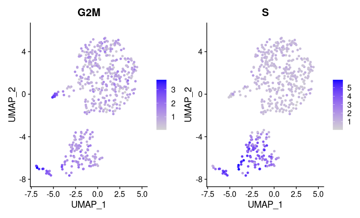
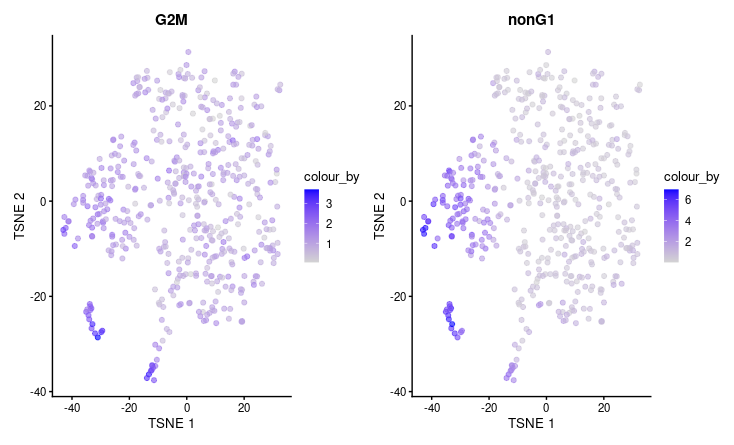

 


# 1 Introduction

**scGSEA** offers flexible compatibility with a variety of commonly used single-cell data structures. It supports seamless integration with Seurat v4, Seurat v5, as well as SingleCellExperiment objects, facilitating a broad range of downstream analyses.

# 2 Installation

```R
library(devtools)
devtools::install_github("WXlab-NJMU/scGSEA")
```

```R
library(scGSEA)
```

# 3 Start with Seurat Object

### **Step 1: Load Seurat Object**

For example we load seurat object

```R
data(obj)
```

### **Step 2: Normalize and Scale Data for scGSEA**

This function performs gene filtering based on the minimum fraction of nonzero expression (`gene_expr_frac`), applies optional k-nearest neighbor (kNN) smoothing (`kNN`) to denoise the data (Seurat objects only), and scales the expression matrix to have zero mean and unit variance for each gene.

The processed data is stored as a new assay `"scGSEA"` for Seurat objects, or added to the `metadata` slot for SingleCellExperiment objects.

```R
obj <- scGSEA.scale.data(obj, kNN = 51)
obj@assays$scGSEA@data[1:5,1:5]
```

### **Step 3: Load Gene Sets**

`scLoadGS` loads and filters gene sets for use in single-cell GSEA analysis. It supports both **Seurat** and **SingleCellExperiment** objects.

The function reads gene sets from a `.gmt` file, optionally restricts them to highly variable genes (HVGs), and applies size-based filtering by excluding gene sets that are too small or too large.

The output is a `SeqGeneSet` object that can be directly used in downstream enrichment analyses.

```R
gmtpath <- system.file("extdata", "CC.gmt", package = "scGSEA") 
cc.gs <- scLoadGS(gmtpath, obj, "gene.symbol", genesetsize.min = 2, use.HVG = FALSE)
cc.gs 
```


- Loads gene sets from the `CC.gmt` file.
- Uses `gene.symbol` for gene ID matching.
- Includes gene sets with at least 2 genes.
- `use.HVG = FALSE` to avoid restricting to only highly variable genes.

We can use `getGSgenelist` extract a list of genes in geneSet(s) specificed by GeneSetName.

{r} getGSgenelist(cc.gs,"G2M")

### **Step 4: Calculate and Normalize Enrichment Scores**

This step computes enrichment scores for each gene set in each cell and performs normalization across the dataset.

```R
cc.gs <- scCalES(obj, cc.gs)  # Calculate enrichment scores
cc.gs <- scESnorm(obj, cc.gs) # Normalize enrichment scores
```

`scCalSignif` evaluates the statistical significance of enrichment scores (ES) calculated by scGSEA. It computes **p-values**, **false discovery rates (FDR)**, and **family-wise error rates (FWER)** based on permutation results.

```R
cc.gs <- scCalSignif(cc.gs)
cc.gs
```

### **Step 5: Add Enrichment Scores to Seurat Object**

`add.scGESA.to.obj` integrates scGSEA results into a single-cell object for further downstream analysis or visualization. It supports both **Seurat** and **SingleCellExperiment** objects.

The enrichment scores (`sc.ES`) from the `SeqGeneSet` object are added to:

- The `meta.data` slot (for Seurat objects)
- The `colData` and `reducedDim` slots (for SingleCellExperiment objects)

```R
obj <- add.scGESA.to.obj(obj, cc.gs)
obj$G2M[1:5]
```

### **Step 6:Enrichment Score Distribution**

```R
scESPlot(obj,gene.set = c("G2M","S"),reduction.use = "UMAP")
```



# 4 Start with Single Cell Experiment

### **Step 1: Load** Single Cell Experiment **Object**

```R
data(sce)
```

### **Step 2: Normalize and Scale Data for scGSEA**

```R
sce <- scGSEA.scale.data(sce) metadata(sce)[["scGSEA.scale.data"]][1:5,1:5]
```

### **Step 3: Load Gene Sets**

```R
gmtpath <- system.file("extdata", "CC.gmt", package = "scGSEA")
cc.gs <- scLoadGS(gmtpath, sce, "gene.symbol", genesetsize.min = 2, use.HVG = FALSE)
cc.gs 
```

### **Step 4: Calculate and Normalize Enrichment Scores**

```R
cc.gs <- scCalES(sce, cc.gs)  # Calculate enrichment scores 
cc.gs <- scESnorm(sce, cc.gs) # Normalize enrichment scores
cc.gs <- scCalSignif(cc.gs) 
cc.gs
```

### **Step 5: Add Enrichment Scores to Seurat Object**

```R
sce <- add.scGESA.to.obj(sce, cc.gs) sce$S[1:5]
```

### **Step 6:Enrichment Score Distribution**

```R
library(patchwork)
library(scater)
library(ggplot2)
scESPlot(sce,gene.set = c("G2M","nonG1"),reduction.use = "tsne")
```



# Session info

```R
sessionInfo()
```

